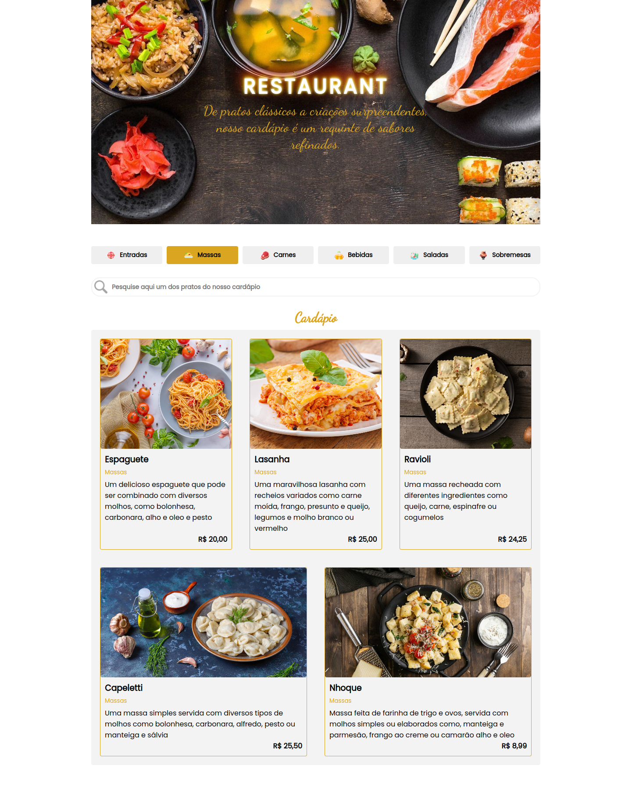

<h1 align="center"> Cardápio de Restaurante </h1>

A proposta desse projeto é criar um site de cardápio para um restaurante em React. 

  <a href="#-tecnologias">Tecnologias</a>&nbsp;&nbsp;&nbsp;|&nbsp;&nbsp;&nbsp;
  <a href="#-projeto">Projeto</a>&nbsp;&nbsp;&nbsp;|&nbsp;&nbsp;&nbsp;
  <a href="#memo-licença">Licença</a>

  

 

  

## 🚀 Tecnologias

Esse projeto foi desenvolvido com as seguintes tecnologias:

- Next.JS

## 💻 Projeto

A proposta desse projeto é criar um site de cardápio para um restaurante em React.

## :memo: Licença

Esse projeto está sob a licença MIT.

---